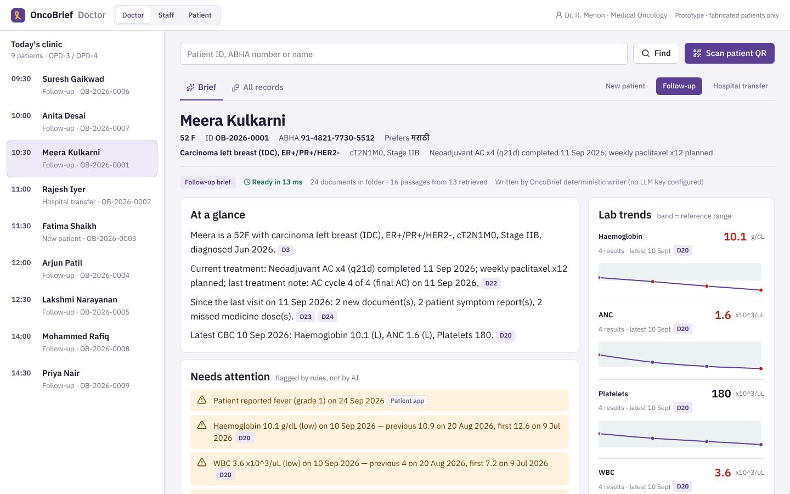
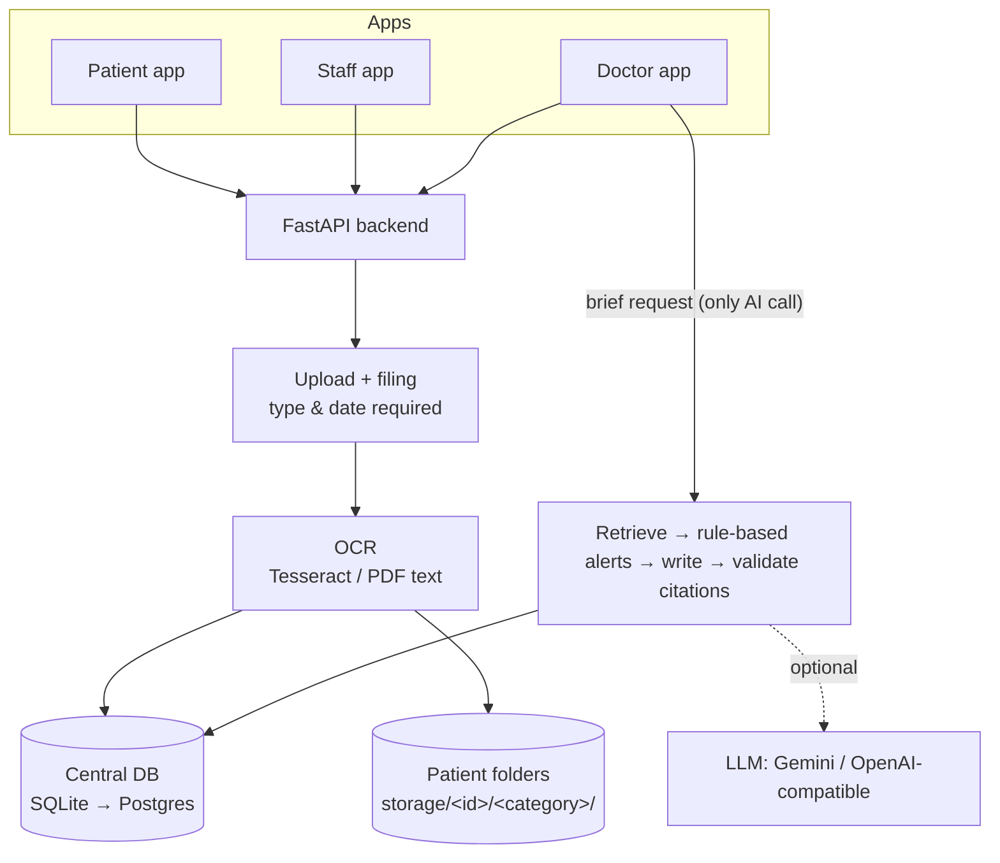
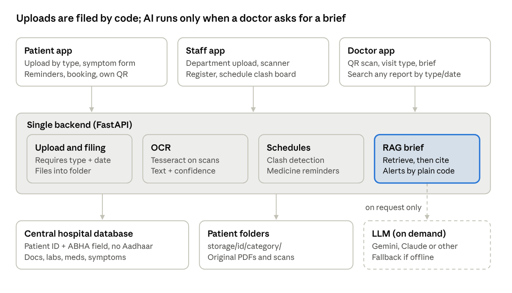
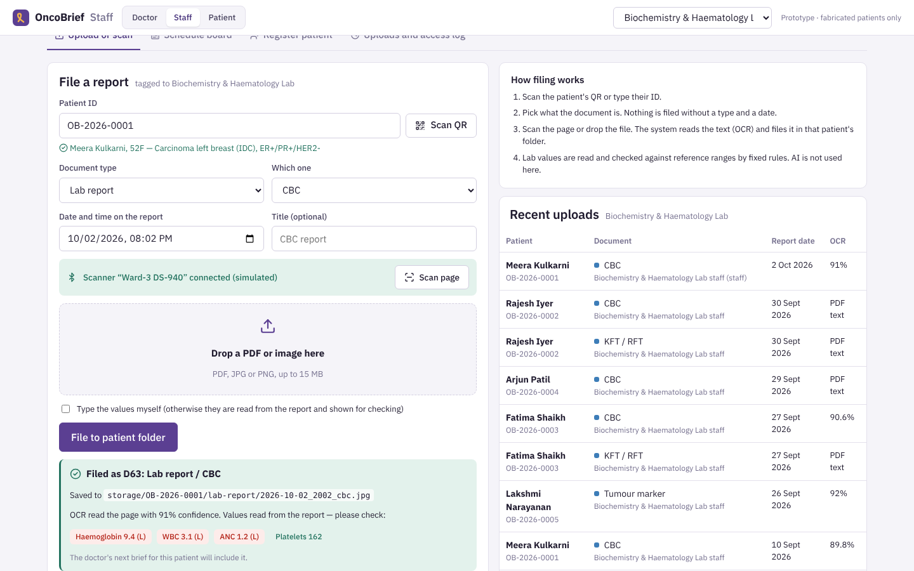
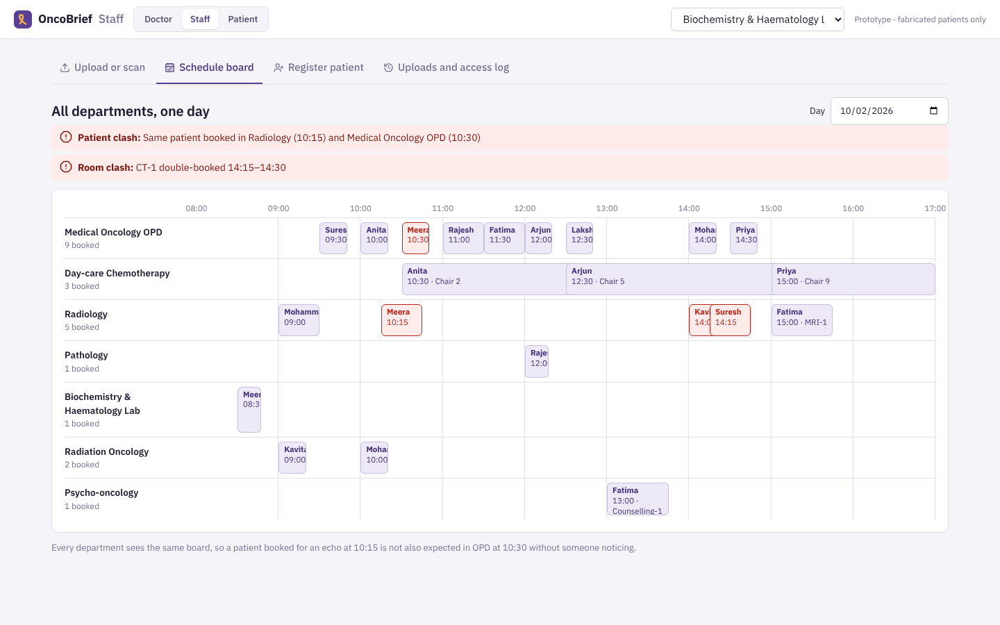
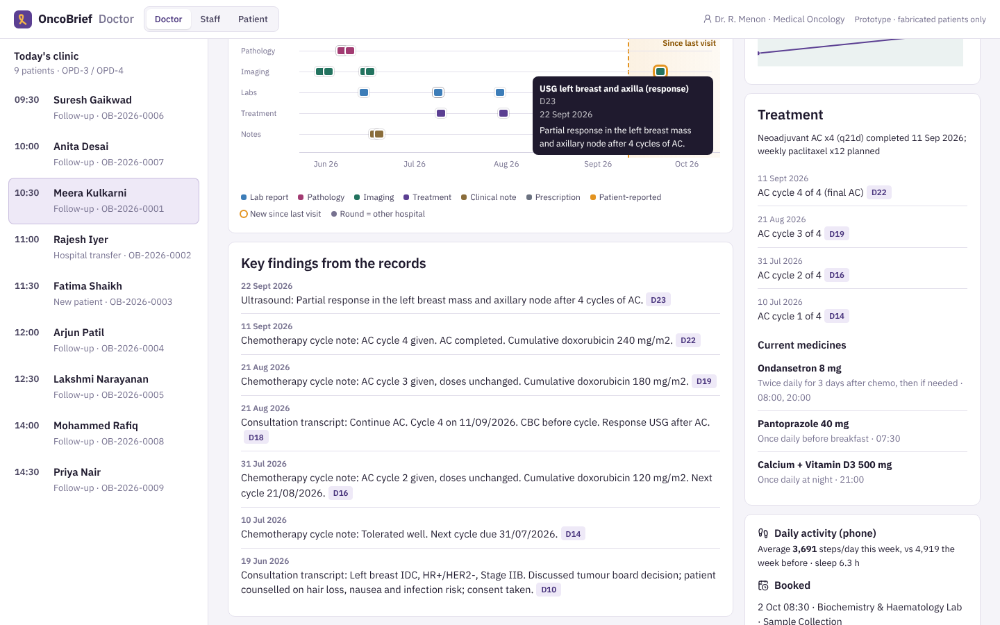
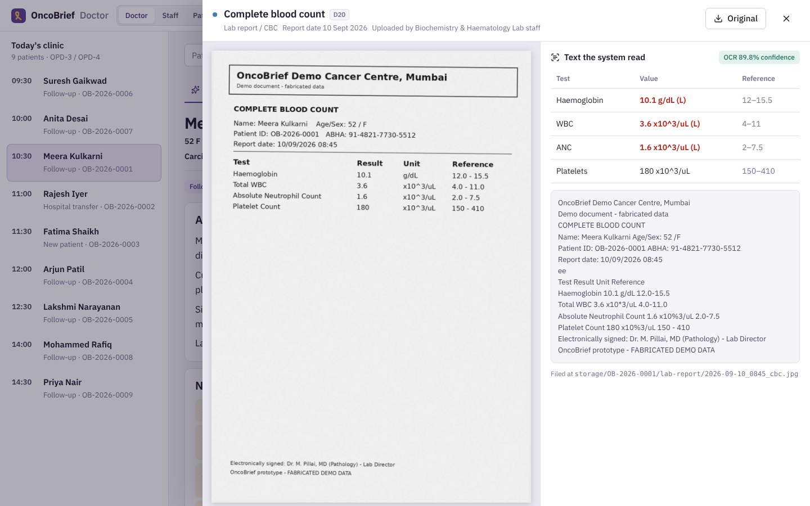
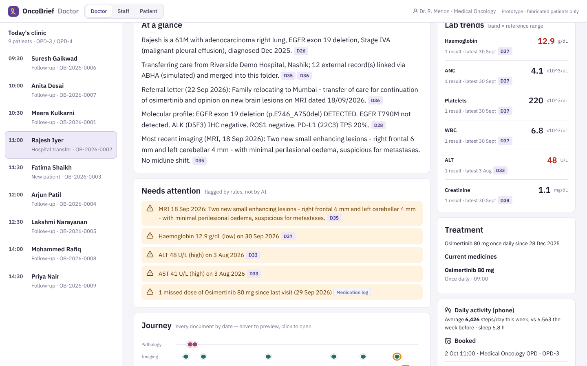
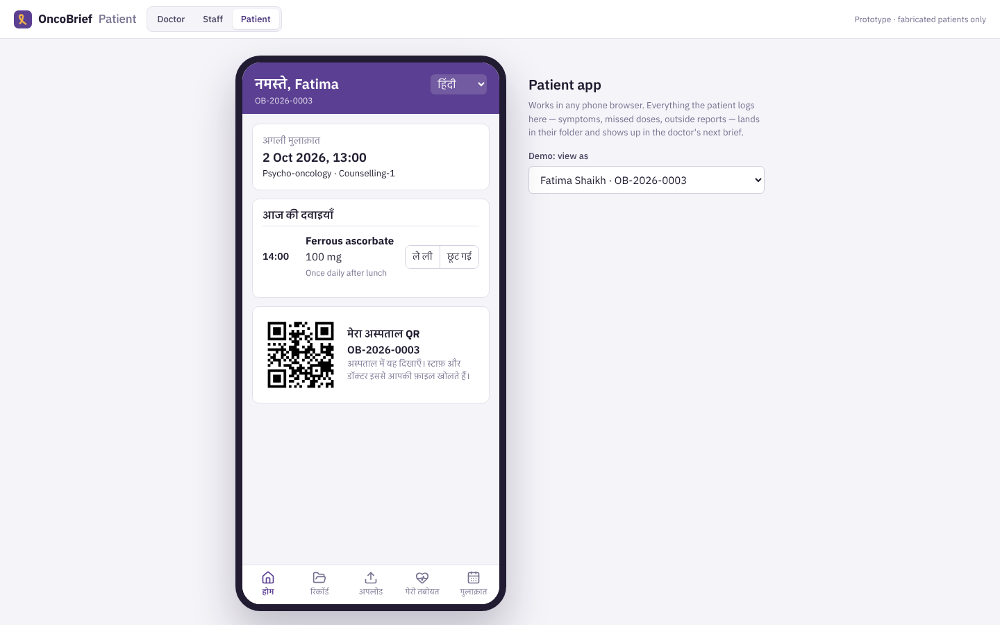

<div align="center">

# OncoBrief

**Every oncology consult starts with the whole story.**

One central patient folder, three connected apps (Doctor · Staff · Patient), and an on-demand brief that gives the oncologist the patient's journey on one page, with every line linked to the original report.

Team **TripleT** · Health-a-thon 2026 (KCDH, IIT Bombay) · Cancer Care (NCG) track

[**Live demo**](https://oncobrief.onrender.com) · [**2-minute video**](https://drive.google.com/file/d/106iAKmisQ6bGN5d2M1TO0lcrSOYqFZta/view?usp=sharing) · [API docs](https://oncobrief.onrender.com/docs)

</div>



> **All patients, hospitals, doctors and reports in this repository are fabricated.** OncoBrief summarises existing records. It does not diagnose, stage or recommend treatment.

---

## The problem

Oncologists spend a large share of every consultation on the record instead of the patient: one study of head-and-neck cancer clinics measured **44% of initial and 31% of follow-up consultation time** on EHR tasks ([Ebbers et al., *Appl Clin Inform* 2022](https://thieme-connect.de/products/ejournals/html/10.1055/s-0042-1756422)). In Indian cancer centres the history is scattered across physical files, different EMRs, outside PDFs and phone photos ([NCG EMR initiative, *Bull WHO* 2025](https://www.ncbi.nlm.nih.gov/pmc/articles/PMC12057217/)), and symptoms between visits often never reach the team ([UHealth/ASCO, 2018](https://old-prod.asco.org/sites/new-www.asco.org/files/content-files/practice-patients/documents/Uhealth-Patient-Communication-Cancer-Symptoms.pdf)).

## What the prototype does

| App | Who | What works in this prototype |
| --- | --- | --- |
| **Doctor** | Oncologist | Today's clinic queue · scan patient QR (camera or photo) · choose **New / Follow-up / Hospital transfer** · brief in milliseconds with alerts, journey timeline, lab trends, patient-reported symptoms · click any citation to open the original scan · search all records by type, date or words inside the report |
| **Staff** | Labs, radiology, OPD, records | One upload screen for every department · pick type first, then file · simulated Bluetooth scanner · OCR + rule-based lab-value reading · register patient with QR card · cross-department schedule board with **patient and room clash detection** · access log |
| **Patient** | Patient / family | Medicine reminders with taken/missed · symptom and missed-medicine form in **English, Hindi, Marathi** · upload outside reports by photo · book appointments · past visit notes · steps from phone (simulated) |

## How it works





**Design rules**

1. **Filing is structural, not AI.** The uploader chooses the document type before the file. The API refuses an upload without patient ID, type, subtype and date, so documents never need sorting afterwards.
2. **AI runs once, on demand.** Only the doctor's brief uses retrieval + generation. Uploads, OCR, lab flags and schedule clashes are plain code.
3. **Every statement is cited.** Each line carries `D<id>` tags. Statements whose sources are not documents of *this* patient are dropped before display (tested in `backend/tests`).
4. **Works without an API key.** With no LLM configured, a deterministic writer builds the brief from the same retrieved records, so the demo never breaks.
5. **Honest about scan quality.** OCR confidence is stored per document; low-quality scans are flagged "read the original".

### The brief pipeline (`backend/app/services/brief.py`)

| Stage | What happens | AI? |
| --- | --- | --- |
| 1. Structured pull | Profile, labs, medicines, symptom reports, missed doses, bookings | No |
| 2. Retrieve | OCR text chunked; BM25 scored with a **visit-type query plan** + recency; max 2 chunks per document | No |
| 3. Alerts | Out-of-range labs with previous/first values, patient-reported fever or grade-3 symptoms, missed doses, imaging sentences reporting change (negations skipped), low-quality scans, documents missing for a new patient | No |
| 4. Write | LLM writes summary + key findings as JSON with citations — or the deterministic writer | Optional |
| 5. Validate | Drop any statement without a valid source from this patient's folder | No |

## Screens

| Staff: scan, OCR, file | Staff: one schedule, clashes caught |
| --- | --- |
|  |  |
| **Doctor: journey timeline** | **Doctor: citation opens the original scan** |
|  |  |
| **Doctor: hospital-transfer brief** | **Patient app (Hindi)** |
|  |  |

## Try it in one minute

1. **Staff app** → patient `OB-2026-0001` (Meera Kulkarni) → **Scan page** → **File to patient folder**. OCR reads Hb 9.4, ANC 1.2 and flags them.
2. **Doctor app** → Meera in today's clinic → **Follow-up**. The new CBC is in the brief and cited; click `D63` to see the scan next to its OCR text.
3. **Patient app** → *How I feel* → report a symptom → regenerate the brief: it appears under "Reported by the patient".

Other demo patients: **Rajesh Iyer** (`OB-2026-0002`, hospital transfer with records linked from another hospital and a new MRI finding), **Fatima Shaikh** (`OB-2026-0003`, new patient with a low-quality phone photo of an outside biopsy and missing MRI), **Arjun Patil** (`OB-2026-0004`), **Lakshmi Narayanan** (`OB-2026-0005`, rising CEA).

## Run it

**Docker (one command)**

```bash
docker build -t oncobrief . && docker run -p 8000:8000 oncobrief
# open http://localhost:8000
```

**Local development**

```bash
# backend (needs Tesseract: apt install tesseract-ocr  /  brew install tesseract)
cd backend && pip install -r requirements.txt
uvicorn app.main:app --reload --port 8000

# frontend (second terminal)
cd frontend && npm install && npm run dev      # http://localhost:5173, proxies /api to :8000
```

The database seeds itself on first start (and each new day, so "today's clinic" is always today). `POST /api/admin/reset-demo` or the **Reset demo data** link restores it.

**Tests:** `cd backend && pytest -q`

### Optional: switch on an LLM

| Variable | Example |
| --- | --- |
| `LLM_PROVIDER` | `gemini`, `anthropic`, `openai` (any OpenAI-compatible host), or `none` |
| `LLM_API_KEY` | your key — set it in the hosting dashboard, never commit it |
| `LLM_MODEL` | `gemini-2.5-flash`, `gpt-4o-mini` |
| `LLM_BASE_URL` | only for OpenAI-compatible hosts, e.g. Groq |

Only the retrieved excerpts for one patient are sent, with name and phone removed (patient ID only).

## Deploy (free)


**Render:** fork/push this repo → [render.com](https://render.com) → **New → Blueprint** → select the repo. `render.yaml` builds the Dockerfile and checks `/api/health`. Free instances sleep after inactivity; open the site a minute before judging.

Any Docker host works the same way (Railway, Koyeb, Fly.io).

## Repository

```
backend/
  app/
    main.py              FastAPI app; serves API + built frontend
    models.py            10 tables: patients, documents, lab_values, medications, med_logs,
                         symptom_reports, appointments, activity, briefs, audit_log
    taxonomy.py          document types, departments, reference ranges, symptoms, checklists
    routers/             patients · documents (upload, OCR, search, scanner) · care · brief
    services/            ocr.py · retrieval.py · brief.py · llm.py
  seed/                  fabricated demo world + report renderer (PDFs and "scanned" JPEGs)
  tests/                 API tests (filing rules, citation validity, clashes, OCR search)
frontend/src/
  apps/doctor|staff|patient/   the three apps
  components/            UploadForm (shared), DocViewer, QrScanner, LabChart
docs/                    architecture diagram, screenshots
Dockerfile · render.yaml · .github/workflows/ci.yml
```

## What is real and what is simulated

| Real in this prototype | Simulated | Future work |
| --- | --- | --- |
| Database, typed uploads, patient folders, OCR, lab flagging, retrieval, cited briefs, search, QR, reminders, symptom form, booking, clash detection, audit log | Bluetooth scanner (returns a scanned page), phone health-app steps, ABHA/ABDM record exchange for transfers, logins (role picker) | ABDM sandbox certification, hospital SSO and role-based access, SMS/WhatsApp reminders, Postgres with encryption at rest, clinician-validated prompts |

## Privacy and safety

No Aadhaar stored; ABHA optional · one database per hospital · audit log of every view and upload · LLM receives pseudonymised excerpts only · disclaimer on every brief · original document always one click away.

## Team TripleT

| | Role |
| --- | --- |
| Shreyansh Tripathi | Team lead · IIT Bombay |
| Sachin Budania | Technical lead · IIT Bombay |
| Yogesh Sanjay Dudhgaonkar Patil | Engineer · IIIT Pune |
| Dr Venkatesh Darshan A N | Doctor partner · Medical Oncology, Tata Memorial Hospital |

MIT licence. Built for Health-a-thon 2026.
